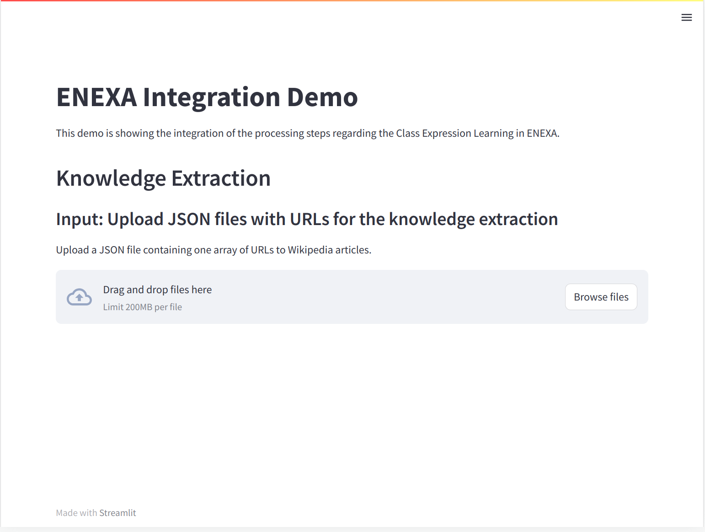

= A demo application for the ENEXA Knowledge Extraction use case



== Installation

```bash
pip install -r requirements.txt
```

== Configuration

The application needs to know where the ENEXA service is running, etc. 
To do so, you need to set the environment variable `ENEXA_SERVICE_URL` to the URL of the service. 

The following parameters are required and can be defined in the link:./.env[`.env`] file or as environment variables:

* `SERVER_ENDPOINT`
* `ENEXA_SHARED_DIRECTORY`
* `ENEXA_WRITEABLE_DIRECTORY` 
* `SLEEP_IN_SECONDS` 

Note, for all of these variables defaults are defined in the link:./app.py[app.py] that are intended to be used for development purposes only.

== Usage

```bash
streamlit run app.py
```

If you worked on the localhost and everything went well, you should see a frontend at http://localhost:8501.

== Docker

You can also run the application in a Docker container. To do so, you need to build the Docker image first:

```bash
docker build -t enexa-knowledge-extraction-demo:latest .
```

Then you can run the container:

```bash
docker run -p 8501:8501 enexa-knowledge-extraction-demo:latest
```

== For Developers

If you want to develop on the frontend, you can use the following commands to start the required services:

* Start the Fuseki triplestore, cf. https://github.com/EnexaProject/enexa-service/tree/develop-implementService-startContainer#triplestore 
* Start the ENEXA service, cf. https://github.com/EnexaProject/enexa-service/tree/develop-implementService-startContainer#starting-the-enexa-service
